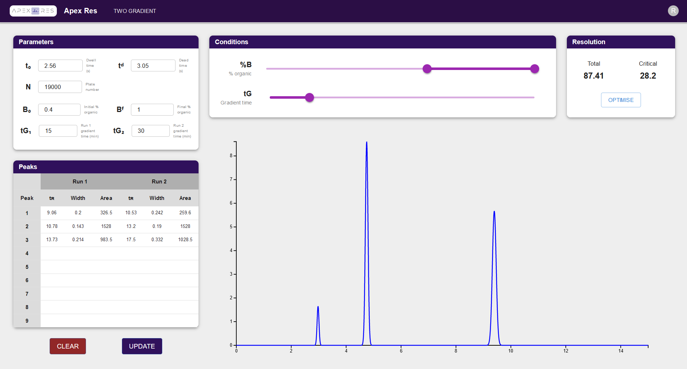

<p align="center">
  
  <h1 align="center">Apex Res</h1>
</p>

## Overview

Apex Res is a reversed-phase HPLC retention modelling web application for optimisation of chromatographic analyte separation.

Currently, users supply two scouting runs with different gradient times and the application will interactively model and visualise retention across all valid gradient conditions using the Linear Solvent Strength (LSS) model.

Future work will include the ability to model retention using more complex models.

## Contents

- [Deployment](#deployment)
- [Installation](#installation)
  - [Backend](#backend)
  - [Frontend](#frontend)
- [Documentation](#documentation)
- [Screenshots](#screenshots)

## Deployment

Deployment is controlled using docker compose.

Linux users can install docker and docker compose by following the instructions [here](https://docs.docker.com/compose/install/). Windows users will first need to install WSL2 and then follow the Linux instructions.

Once docker and docker compose are installed, the application can be deployed by running the following command in the root directory of the repository:

```bash
docker compose -f deploy/docker-compose.yml up -d --build
```

This will build the docker images and start the application. The application will be available at http://localhost:3000.

## Installation

### Backend

The backend is a Python FastAPI application, which can be installed using poetry via the following command:

```bash
poetry install
```

The application can be run locally using the following command:

```bash
poetry run hypercorn apex_res.main:app --bind 0.0.0.0:8080
```

### Frontend

The frontend is a React application, which can be installed using npm via the following command:

```bash
npm install
```

The application can be run locally using the following command:

```bash
npm start
```

## Documentation

Documentation describing the authentication procedure and retention modelling algorithm can be found in the [docs](./docs) directory.

## Screenshots


